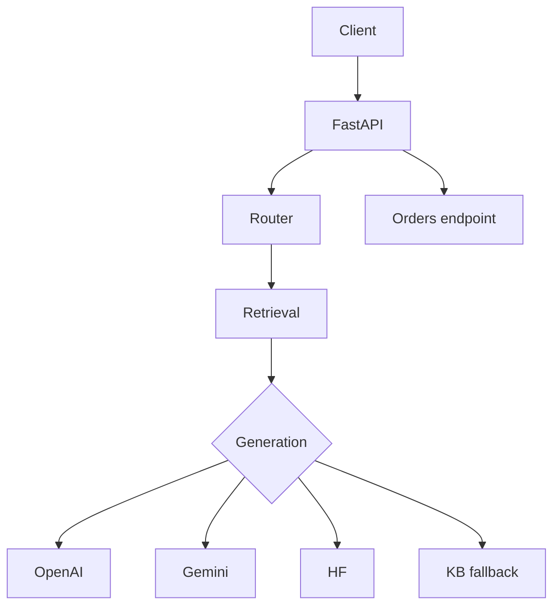
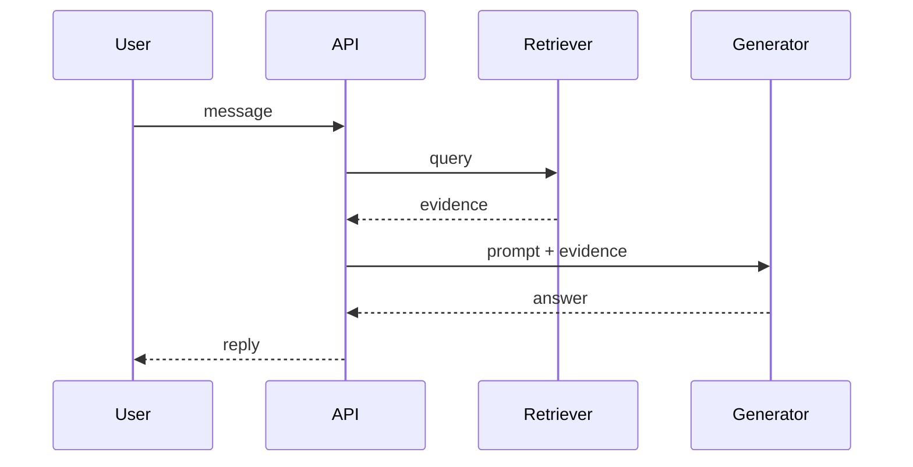
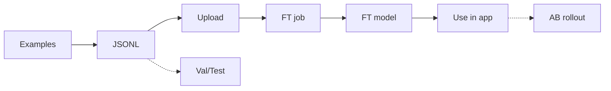
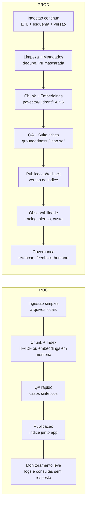

# Visão Geral Detalhada do Projeto de Chatbot de Suporte para Entregas

Documento descritivo do que foi criado: estrutura de código, dados, fluxos de RAG + geração, configuração de modelos (OpenAI, Gemini, HF) e noções de fine-tuning.

## Arquitetura (Diagrama)
```
[Cliente/API] -> FastAPI (/chat, /pedido, /healthz)
    |
    v
[Roteamento simples no /chat]
    |
    v
[Retrieval TF-IDF] ---> data/kb.json (FAQ) + policies/users (expansão futura)
    |
    v
[Geração]
    |-- OpenAI (OPENAI_API_KEY, OPENAI_MODEL)  # prioridade
    |-- Gemini (GEMINI_API_KEY, GEMINI_MODEL)  # fallback 1
    |-- HF pipeline (HF_MODEL + torch)         # fallback 2
    |-- Resposta direta do KB                  # fallback final

[/pedido/{order_id}] -> lookup em data/orders.json
```

### Diagramas Mermaid (e ASCII de apoio)

Arquitetura (Mermaid):


Fluxo RAG (Mermaid):


Fluxo de Fine-tuning (Mermaid):


ASCII (fallback rápido):
```
[Cliente] -> FastAPI -> Router -> Retrieval -> Geração(OpenAI/Gemini/HF) -> Resposta
/pedido/{id} -> orders.json

FT: Exemplos -> JSONL -> Upload -> Job FT -> Modelo FT -> App
```

## Módulos e Responsabilidades
- `app/main.py`: API FastAPI; endpoints `/chat`, `/pedido`, `/healthz`; carrega retriever, detecta modelos ativos (OpenAI, Gemini, HF), executa fluxo e devolve metadados (`via_modelo`, `aviso_modelo`).
- `app/retriever.py`: TF-IDF em memória sobre `data/kb.json`; retorna top-k com `score`.
- `app/orders.py`: utilitário para pedidos mock em `data/orders.json`.
- `app/llm_hf.py`: pipeline de geração com Hugging Face (`HF_MODEL`), via `transformers`.
- `app/openai_client.py`: cliente OpenAI; usa `OPENAI_API_KEY` e modelo configurável (`OPENAI_MODEL`, default gpt-4o-mini).
- `app/gemini_client.py`: cliente Gemini; usa `GEMINI_API_KEY` ou `GOOGLE_API_KEY` e modelo configurável (`GEMINI_MODEL`, default gemini-1.5-flash).
- `data/source/`: KB, pedidos, políticas, usuários.
- `data/ft/`: dataset de fine-tuning.
- `docs/ARCHITECTURE_AND_PIPELINE.md`: esta documentação.
- `README_QUICKSTART.md`: guia rápido; `README.md`: sumário de docs.

## Dados Mock
- `data/source/kb.json`: FAQ/políticas curtas (pergunta, resposta, tags).
- `data/source/orders.json`: pedidos mock (PED-123 etc.) para status/reembolso/cancelamento.
- `data/source/users.json`: 100 usuários mock (perfil, região, tier, canal) para personalização/segmentação.
- `data/source/policies.json`: políticas detalhadas (reembolso, atraso, cancelamento, alergia, segurança).
- `data/ft/ft_openai.jsonl`: exemplos de chat para FT (tom empático, respostas curtas).
- Índice vetorial: `data/cache/kb_index.joblib` (gerado com `python -m app.ingest`), usado pelo `VectorRetriever`.

## Fluxo `/chat` (detalhado)
1) Recebe `mensagem` em POST `/chat`.
2) Retriever TF-IDF busca o melhor item do KB (por enquanto `kb.json`; pode ser expandido para policies/users).
3) Geração (prioridade):
   - OpenAI se `OPENAI_API_KEY` presente; modelo default `gpt-4o-mini` (pode sobrescrever em `.env` com `OPENAI_MODEL`).
   - Gemini se `GEMINI_API_KEY` ou `GOOGLE_API_KEY` presente; modelo default `gemini-1.5-flash`.
   - HF se `HF_MODEL` definido e `torch` instalado.
   - Sem modelo: resposta direta do KB.
4) Saída: `resposta`, `fonte` (pergunta do KB), `via_modelo` (bool), `aviso_modelo` (motivo do fallback).

## Fluxo `/pedido/{order_id}`
1) GET com `order_id` (formato PED-123).
2) Busca em `data/orders.json`; retorna status, ETA, itens, total; erro simples se não encontrar.

## Configuração via `.env` (carregado automaticamente)
- OpenAI:
  - `OPENAI_API_KEY=<chave>`
  - `OPENAI_MODEL=gpt-4o-mini` (opcional, default já é gpt-4o-mini)
- Gemini:
  - `GEMINI_API_KEY=<chave>` (ou `GOOGLE_API_KEY`)
  - `GEMINI_MODEL=gemini-1.5-flash` (opcional)
- Hugging Face:
  - `HF_MODEL=<nome_ou_caminho_modelo>` (requer `torch` instalado)

## Execução
```bash
python3 -m venv .venv && source .venv/bin/activate
pip install -r requirements.txt
echo "OPENAI_API_KEY=..." >> .env   # ou GEMINI_API_KEY / HF_MODEL
uvicorn app.main:app --reload
```
Testes:
```bash
curl http://127.0.0.1:8000/healthz
curl -X POST http://127.0.0.1:8000/chat -H "Content-Type: application/json" -d '{"mensagem":"Meu pedido atrasou"}'
curl http://127.0.0.1:8000/pedido/PED-123
```

## Fine-tuning (explicação prática e teórica)
- Objetivo: melhorar estilo/consistência em intents críticas; não substituir RAG para fatos dinâmicos.
- Dataset exemplo: `data/ft_openai.jsonl` (formato chat messages). Amplie para 200–1000 exemplos bem variados.
- OpenAI (teoria resumida):
  1) Separar treino/val.
  2) Subir arquivo (`openai files upload --purpose fine-tune ...`).
  3) Criar job (`openai fine_tuning.jobs.create -m <base> -t <file_id>`).
  4) Usar `fine_tuned_model` resultante como `OPENAI_MODEL` no app.
- Gemini: fluxo similar (dataset + job de tuning + usar modelo ft retornado).
- Open-source (LoRA/QLoRA): converter para formato instrução (`instruction/input/output`) e treinar em modelos leves (ex.: Mistral 7B) com PEFT; usar FT para tom/estrutura, mantendo RAG para conhecimento.
- Métricas/boas práticas:
  - Medir aderência a formato (2 frases, tom empático), recusa correta quando falta contexto.
  - Não colocar fatos que mudam no FT; esses ficam no RAG.
  - Versionar modelos FT e liberar via flag/AB.

## Próximos Passos Técnicos
- Integrar `policies.json` e `users.json` no retriever e/ou endpoints (ex.: `/politica/<tema>`, `/usuario/<id>`).
- Adicionar um roteador simples por intenção (pedido, política, usuário) antes de gerar.
- Criar testes automatizados (Pytest) para `/chat` e `/pedido`.
- Adicionar logs estruturados e tracing (OpenTelemetry) para tool calls e geração.

## Pipeline de Produção (alto nível)
- Infra/Config: containerizar (Docker), definir envs e secrets (vault), provisionar storage de dados (KB/policies/users) e backend de cache/DB se necessário. Escolher orquestração (ECS/K8s/Cloud Run).
- Build/CI: pipeline (GitHub Actions/GitLab CI) com lint/test, build da imagem, push para registry, templates Helm/Terraform se usar K8s.
- CD/Deploy: canary ou blue-green; feature flags para trocar modelo (base/ft, OpenAI/Gemini/HF); healthchecks prontos (/healthz).
- Dados/RAG: separar ingestão/indexação; versionar KB/policies/users; planejar atualização incremental; avaliar migrar de TF-IDF para vetor (pgvector/Qdrant/FAISS).
- Segurança: auth (JWT/API key), rate limiting, logs sem PII (mascarar telefone/email), secrets no vault, CORS ajustado, bloquear coleta de dados sensíveis (cartão etc.).
- Observabilidade: tracing (OpenTelemetry), logs estruturados de tool calls e geração, métricas de latência/custo/erros; dashboards e alertas.
- Modelos: definir ordem de fallback (OpenAI → Gemini → HF → KB), timeouts/retries; versionar prompts e modelos; FT com flag/AB para rollout seguro.
- Avaliação: suite de casos críticos (RAG/pedidos), testes automatizados no CI, canary/AB em produção; métricas de groundedness e “não sei”.
- Operação: rollback rápido (última imagem), rotação de chaves, reindexação periódica do KB, revisão de logs e feedback humano para melhorar prompts/FT.

## Pipeline de Dados (POC vs Robust)
- POC (simples):
  - Ingestão: ler arquivos locais (FAQ/políticas/pedidos) e validar campos básicos.
  - Chunk/Index: blocos curtos; TF-IDF ou embeddings simples em memória/FAISS local.
  - QA rápido: poucos casos sintéticos/golden para checar recuperação e resposta plausível.
  - Publicação: índice junto com a app; versão manual (nome/sha do arquivo).
  - Monitoramento leve: logs de consultas sem resposta/erro.
- Robust (produção):
  - Ingestão contínua com validação de esquema, timestamps/versão do corpus.
  - Limpeza/enriquecimento: dedupe, metadados (região, canal, idioma), mascarar PII.
  - Chunk/Embeddings: blocos 200–400 tokens com overlap; embeddings consistentes; indexação em pgvector/Qdrant.
  - Validação/QA: testes de integridade do índice; suite de casos críticos para groundedness/precisão/“não sei”.
  - Publicação/rollback: versionar corpus+índice; canary/flag; rollback fácil.
- Observabilidade: métricas de recall/groundedness online, alertas para quedas; logs estruturados.
- Governança: retenção e anonimização; rastreabilidade de versões; feedback humano para iterar (ingestão/FT/prompt).

## Pipeline Integrado (dados + produção) - Mermaid

